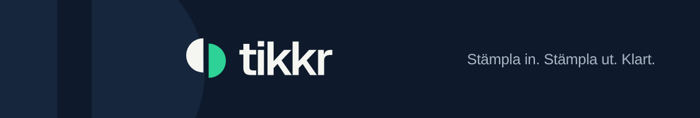
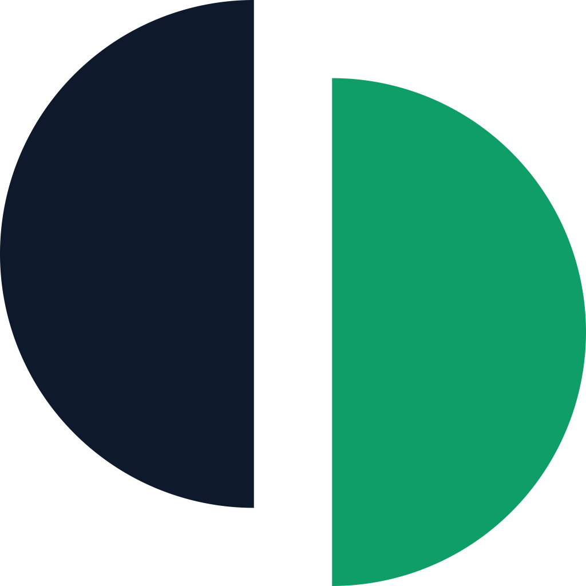

<p align="center">
  <picture>
    <source media="(prefers-color-scheme: dark)" srcset="brand/03-social/tikkr-linkedin-cover-company-1128x191-dark.png">
    <source media="(prefers-color-scheme: light)" srcset="brand/03-social/tikkr-linkedin-cover-company-1128x191-light.png">
    
  </picture>
</p>

<p align="center">
  
  
  
  
  
  
  
</p>

<p align="center">
  <b>Molnbaserat stämplingssystem för touchskärm.</b><br>
  Anställda stämplar in och ut på order och arbetsmoment med ett enda tryck.<br>
  Byggt för svenska verkstads- och tillverkningsföretag.
</p>

---

## Vad systemet består av

| Yta | Vem | Vad |
|---|---|---|
| **Kiosken** | Anställda | Touchskärm i verkstaden. Namn → stämpla in → order → moment. Ingen PIN, ingen bekräftelseruta, offline-kö när nätet hackar |
| **Adminpanelen** | Kundens administratör | Anställda, kunder, ordrar, moment, rapporter, fakturaunderlag och efterkalkyl som PDF, Excel-export, granskning av flaggade stämplingar |
| **Plattformspanelen** | Oss | Kundregister, supportläge (läsning, med spår), Stripe-artiklar, utskick och driftläge |

Kärnflödet: ett tryck på namnet, ett på ordern, ett på momentet. Stämplar någon
in på ett nytt jobb **på samma arbetsmoment** stämplas hen automatiskt ut från
det förra — en maskin kör ett jobb i taget. Ett **annat** moment läggs till
bredvid, och båda löper parallellt.

### Tillval

Basen är stämpling mot order, och den är alltid på. Två moduler säljs till,
var för sig:

| Modul | Innehåll | Pris/mån | Pris/år |
|---|---|---|---|
| **Löneunderlag** | Schema, raster, flex, komp och frånvaro | 499 kr | 4 990 kr |
| **Planering** | Stationer, veckovis tidslinje, planerat mot stämplat | 699 kr | 6 990 kr |

Basen kostar 399 kr per aktiv stämplingsskärm och månad, 3 990 kr per år. Allt
exklusive moms, ingen bindningstid. Priserna sätts på artiklarna hos Stripe och
läses därifrån — siffrorna i koden är reserv.

---

## Tre underlag som aldrig delar kod

Systemets viktigaste gräns, byggd med tester som faller om någon suddar ut den.

```
 FAKTURAUNDERLAGET          LÖNEUNDERLAGET             PLANERINGEN
 "vad ska kunden betala"    "hur mycket har någon      "när ska jobbet köras,
                             arbetat"                   och på vilken maskin"

 order-export.ts            payroll.ts                 planning.ts
 order-calc.ts              schedule.ts                plan-calendar.ts
 order-price.ts             absence.ts · breaks.ts     plan-live.ts
 pdf.ts · report.ts         timesheet-pdf.ts
```

> En operatör kör två maskiner 08–12. Fakturaunderlaget visar **åtta**
> maskintimmar — båda ordrarna ska betala sin. Tidrapporten visar **fyra**
> timmar, för så länge var personen på jobbet. Planeringen visar en avsikt som
> aldrig får faktureras alls.

Samma timme, tre riktiga svar. Därför importerar fakturasidan aldrig
lönefilerna eller planeringsfilerna, och planeringen skriver aldrig till
stämplingarna. Bevisas av
[`tests/payroll-boundary.test.ts`](tests/payroll-boundary.test.ts) och
[`tests/planning-boundary.test.ts`](tests/planning-boundary.test.ts).

Övriga spärrar av samma sort:

| Test | Faller när |
|---|---|
| `tenant-isolation` · `tenant-coverage` | En fråga kan nå ett annat företags data |
| `module-coverage` | En sida som rör en modul glömt att kalla `requireModule()` |
| `support-coverage` | En adminåtgärd glömt `assertWritable()`, och supportläget kan skriva |
| `brand` | En färg utanför paletten, eller ordmärket satt som text |
| `format` · `ui-text` | Tid visas som decimaltimmar, eller texten bryter mot tonen |

Resonemanget bakom besluten står i [CLAUDE.md](CLAUDE.md), språket i
[TONE-OF-VOICE.md](TONE-OF-VOICE.md).

---

## Teknikstack

| Del | Val |
|---|---|
| Frontend + backend | En enda Next.js-app (App Router, TypeScript) |
| Styling | Tailwind CSS 4, typsnittet Geist via `next/font` |
| Databas | Postgres 17 i en container, inget plattformslager ovanpå |
| ORM | Prisma, med ett eget multi-tenant-lager (`src/lib/tenant.ts`) |
| Auth | Auth.js för admin, device-token för kiosken |
| Dokument | pdfkit (PDF), exceljs (Excel), egen zip i `src/lib/zip.ts` |
| Betalning | Stripe Billing — licenser per skärm plus moduler som egna rader |
| E-post | Microsoft Graph, avsändare `noreply@tikkr.se` |
| Offline | PWA, service worker och lokal kö i IndexedDB |
| HTTPS | Nginx Proxy Manager i labbet, Caddy i produktion |
| Tester | Vitest mot en egen testdatabas |

**Designprincip: så få containrar som möjligt.** I praktiken två — appen och
databasen — plus en `migrate`-container som kör och avslutas.

```
Din laptop  →  GitHub  →  Servern: git pull + docker compose up -d
 (skriva kod)   (kodens hem)        (här kör det på riktigt)
```

---

## Första uppsättningen på servern

Kräver Docker och Docker Compose. Kör allt i den mapp du vill ha projektet i.

**1. Hämta koden**

```bash
git clone <repo-url> tikkr && cd tikkr
```

**2. Skapa inställningsfilen**

```bash
cp .env.example .env
```

**3. Sätt ett riktigt databaslösenord**

```bash
sed -i "s|byt-ut-mig|$(openssl rand -base64 32 | tr -d '/+=')|g" .env && grep POSTGRES_PASSWORD .env
```

**4. Starta**

```bash
docker compose up -d --build
```

Första bygget tar några minuter. Därefter går det på sekunder.

**5. Kontrollera att det lever**

```bash
curl -s localhost:3000/api/health
```

Ska svara `{"status":"ok","database":"ok"}`. Svarar den `unreachable` når appen
inte databasen — kolla `docker compose logs db`.

**6. Lägg in testdata**

```bash
docker compose run --rm migrate node prisma/seed.mjs
```

`migrate`-containern innehåller alla utvecklingsverktyg och används för
engångskommandon. Appcontainern är medvetet avskalad och har dem inte.

Öppna sedan `http://<serverns-ip>:3000` i webbläsaren.

---

## Koppla in en domän via Nginx Proxy Manager

När Tikkr ska nås på en riktig adress med HTTPS istället för `IP:3000`:

Tikkr ansluter till NPM:s Docker-nätverk `npm_proxy`, så proxyn når appen på
containernamnet `tikkr-app`. Databasen ligger inte på det nätet och är därmed
onåbar därifrån.

1. Peka domänens DNS (A-post) mot serverns IP-adress
2. Öppna Nginx Proxy Manager → **Hosts → Proxy Hosts → Add Proxy Host**
3. **Domain Names:** din adress · **Scheme:** `http` · **Forward Hostname:**
   `tikkr-app` · **Forward Port:** `3000`
4. Slå på **Block Common Exploits** och **Websockets Support**
5. Fliken **SSL** → *Request a new SSL Certificate*, kryssa i **Force SSL**

Heter NPM:s nätverk något annat hos dig, ändra `npm_proxy` längst ner i
`docker-compose.yml`. Hitta namnet med:

```bash
docker inspect <npm-container> -f '{{range $k,$v := .NetworkSettings.Networks}}{{$k}} {{end}}'
```

När domänen fungerar: sätt `APP_BIND=127.0.0.1` i `.env` och kör
`docker compose up -d`. Då måste all trafik gå via HTTPS och appen kan inte
längre nås okrypterad på `IP:3000`.

**Kioskens cookie är knuten till adressen.** Byter en kund adress måste varje
skärm öppna sin kopplingslänk på nytt.

---

## Uppdatera till senaste versionen

```bash
git pull && docker compose up -d --build
```

`migrate`-containern sätter upp databasen innan appen startar — inget extra
steg. Finns `prisma/migrations/` kör den migrationerna i tur och ordning,
annars byggs tabellerna direkt ur `prisma/schema.prisma`.

---

## Vanliga kommandon

| Vad | Kommando |
|---|---|
| Se loggar | `docker compose logs -f app` |
| Starta om appen | `docker compose restart app` |
| Stoppa allt | `docker compose down` |
| Öppna databasen | `docker compose exec db psql -U tikkr -d tikkr` |
| Köra testerna | `./scripts/test.sh` |
| Köra vissa tester | `./scripts/test.sh payroll` |
| Driftkontroll | `./scripts/status.sh` |
| Lägga in testdata | `docker compose run --rm migrate node prisma/seed.mjs` |
| Lägga upp ett plattformskonto | `./scripts/platform-user.sh` |
| Stänga glömda stämplingar | `./scripts/auto-close.sh` |
| Säkerhetskopiera | `./scripts/backup.sh` |

---

## Databasen

Under utvecklingen finns **inga migrationsfiler**. Databasen byggs direkt ur
`prisma/schema.prisma` vid varje start. Skälet: servern behöver då aldrig
skriva till GitHub — organisationen blockerar deploy keys, och flödet
laptop → GitHub → server går bara åt ett håll.

Konsekvens: **ändras schemat töms det som ändrats.** Lägg tillbaka testdatan
efteråt.

```bash
docker compose run --rm migrate node prisma/seed.mjs
```

Före produktion skapas en baslinjemigration med `./scripts/create-migration.sh`,
raden tas bort ur `.gitignore`, och `scripts/migrate.sh` byter gren automatiskt
så fort mappen finns. Se [docs/drift.md](docs/drift.md) punkt 1.

### När behöver jag bygga om?

Koden kopieras in i imagen när den byggs. Ändrar du en fil efteråt kör
containern den gamla kopian tills du bygger om.

| Vad du ändrat | Bygga om? |
|---|---|
| `src/` eller `tests/`, och kör `./scripts/test.sh` | Nej — mapparna monteras in |
| `src/`, och vill se det i webbläsaren | Ja |
| `prisma/schema.prisma` | Ja |
| `package.json` | Ja |

```bash
docker compose up -d --build
```

---

## Tester rör aldrig appens databas

Testerna skapar och raderar företag. De körs därför mot en egen databas som
heter `<databasnamn>_test` och skapas automatiskt av `./scripts/test.sh`.

Två spärrar, oberoende av varandra:

1. `npm test` kör inga tester alls, utan skriver ut vilket kommando som gäller.
   Det är kommandot man skriver av vana, och det hade kört mot appens databas.
2. `tests/setup.ts` vägrar starta om databasens namn inte slutar på `_test`,
   oavsett hur testerna startats — via skript, direkt med vitest eller från
   en editor.

Att bara peka om databasen i skriptet vore inte tillräckligt: kör någon
testerna på något annat sätt är det skyddet borta.

> **Båda spärrarna ligger i koden, och koden bakas in i imagen vid bygget.**

---

## Lockfilen

`package-lock.json` låser fast exakta versioner av alla beroenden, så att
bygget blir identiskt varje gång. Den skapas vid första bygget. Hämta ut den
och checka in den en gång:

```bash
docker compose exec app cat package-lock.json > package-lock.json && git add package-lock.json && git commit -m "Lås beroendeversioner"
```

---

## Drift

Vad som måste vara på plats — migrationer i git, schemalagd autoutstämpling,
offsite-backup, HTTPS och övervakning — står i [docs/drift.md](docs/drift.md).

Se läget just nu:

```bash
./scripts/status.sh
```

| Dokument | Innehåll |
|---|---|
| [docs/drift.md](docs/drift.md) | Spärrar innan skarp drift, backup, autoutstämpling |
| [docs/lage.md](docs/lage.md) | Läget mot originalplanen, fas för fas |
| [docs/kiosk-lage.md](docs/kiosk-lage.md) | Chrome Kiosk och Android — låsa ner en skärm |
| [docs/kioskskarm.md](docs/kioskskarm.md) | Hårdvara: skärm, stativ, strömmatning |

---

## Varumärket



Symbolen är en cirkel delad i två: vänstra halvan är instämplingen, den högra
utstämplingen, satt en aning senare. Sex färger, inga fler — och **grönt är
accent, aldrig huvudfärg.**

<br clear="left">

| Namn | HEX | Roll |
|---|---|---|
| Fjord | `#0E1A2B` | Primär. Text, logotyp, mörka ytor, knappar |
| Tick | `#2ED196` | Accent på mörkt |
| Tick Deep | `#0F9E68` | Accent på ljust: länkar, markerat läge |
| Snö | `#F5F6F2` | Ljus bakgrund |
| Skiffer | `#5B6573` | Sekundär text |
| Lav | `#D9DDD6` | Linjer, ramar, tysta ytor |

Logotyper, ikoner och delningsbilder ligger i [brand/](brand/README.md), med
riktlinjerna i sin helhet i
[`brand/Tikkr-brand-guidelines.pdf`](brand/Tikkr-brand-guidelines.pdf). Mappen
är källan och ändras inte för hand — kopiorna i `public/` kopieras om när
materialet byts.

---

<p align="center">
  <sub>Privat repo. Teknisk projektkontext: <a href="CLAUDE.md">CLAUDE.md</a> · Språket: <a href="TONE-OF-VOICE.md">TONE-OF-VOICE.md</a></sub>
</p>
